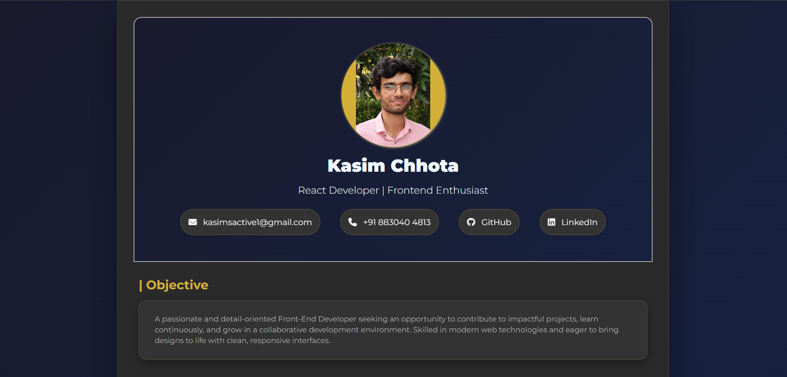

# Personal Portfolio - [Kasim Chhota]

 <!-- Add a screenshot if available -->

A sleek, minimal, and aesthetic personal portfolio website built with React.js and raw CSS, showcasing my projects, skills, and professional journey. Hosted on Netlify for seamless deployment.

🔗 **Live Demo:** [https://kasim-portfolio.netlify.app/](https://kasim-portfolio.netlify.app/) <!-- Replace with your actual Netlify URL -->

## Features

- **Modern UI/UX**: Clean, responsive design with attention to detail
- **Performance Optimized**: Fast loading times and smooth animations
- **Responsive Design**: Works flawlessly on all device sizes
- **Project Showcase**: Elegant display of my best work with case studies
- **Interactive Elements**: Subtle animations and hover effects for better engagement
- **Dark/Light Mode**: Optional - if you implemented this feature

## Technologies Used

- **Frontend**: React.js (Vite)
- **Styling**: Raw CSS (no CSS frameworks) for complete design control
- **Deployment**: Netlify (with continuous deployment from GitHub)
- **Additional Tools**:
  - React Icons for scalable vector icons
  - React Router for smooth navigation
  - (Add any other libraries you used)

## Key Learnings

Through building this portfolio, I deepened my understanding of:

- Advanced CSS techniques (Flexbox, Grid, animations, transitions)
- React component architecture and state management
- Responsive design principles and mobile-first approach
- Performance optimization for React applications
- Netlify deployment and CI/CD workflows
- (Add any other specific learnings)

## Installation

To run this project locally:

1. Clone the repository:
   ```bash
   git clone https://github.com/kasim-kc/portfolio-site.git
   ```
2. Navigate to the project directory:
   ```bash
   cd portfolio-site
   ```
3. Install dependencies:
   ```bash
   npm install
   ```
4. Start the development server:
   ```bash
   npm run dev
   ```
5. Open [http://localhost:5173](http://localhost:5173) to view it in your browser.

## Project Structure

```
src/
├── assets/          # Static assets like images, icons
├── components/      # Reusable React components
├── styles/          # CSS files
├── pages/           # Page components
├── App.js           # Main application component
└── index.js         # Entry point
```

## Future Improvements

- [ ] Add blog section
- [ ] Implement internationalization (i18n)
- [ ] Add more interactive elements
- [ ] Integrate a contact form with Netlify Forms
- (Add your own roadmap items)

✨ Crafted with passion by [Kasim Chhota] - [yourwebsite.com] | [LinkedIn Profile]
